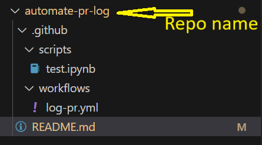
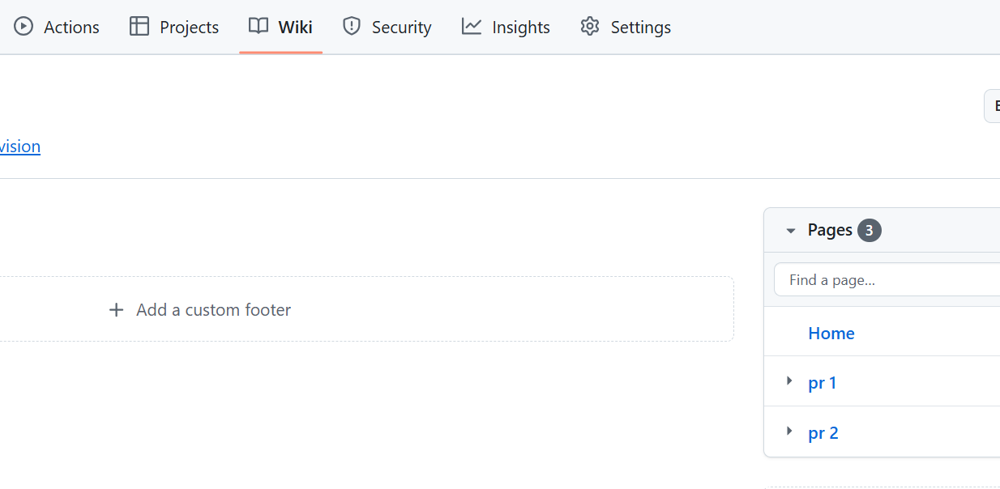

# automate-pr-log
Automating pull requests information in wiki

Step 1:

Create repo in github.

Step 2:

Create branch and clone the repo in local using any IDE (I use vs code).

Step 3: 

Write the appropriate yml code for logging prs (log-pr.yml in this case) in wiki and follow the appropriate folder structure:

 and any other required business logic python/spark code needs to be written in a seperate file (under scripts/)

Step 4:

Enable Wiki by going to repo setting and scrolling down to Wiki option.

Step 5:

Enable read write option in github action workflows by going to action under repo setting and selecting "Read and write permissions" Under Workflow permissions.

Step 6:

Initilize the wiki repo by creating a default wiki page.

Step 7:

Push the changes to above repo branch:

a. git add .
b. git commit -m "your commit message"
c. git push

Step 8:

Go to pull request tab and raise a PR.

Finally git hub action workflow will run automaitcally as soon as you will raise the pr and it will log the pr information (pr 1, pr 2 etc...) in the wiki.

